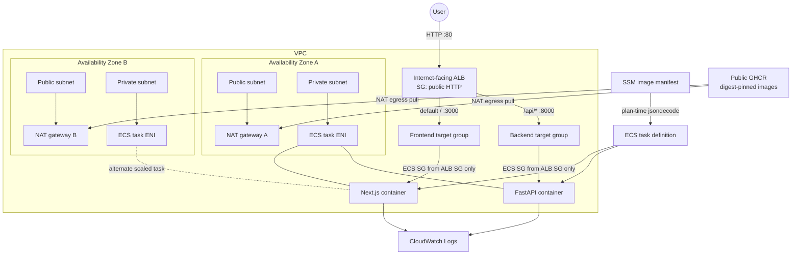

# Runtime architecture

## System view

The ALB exists in both public subnets. A Fargate task receives an ENI in one private subnet, has no public IP, and contains both essential containers. Public route tables reach the internet gateway. Each private route table reaches its same-AZ NAT gateway by default, providing resilient outbound access to GHCR and AWS APIs.

## Request and deployment connections

The user path is `Internet → ALB → ALB security group → private task ENI → ECS security group → selected container`. Frontend and backend have separate target groups because one task exposes two ports. Target type `ip` is required for Fargate `awsvpc` networking.

The image pipeline writes a single JSON SSM parameter. Terraform reads and validates both digest references during planning, so the saved binary plan contains the exact revisions later applied. CloudWatch receives stdout/stderr and Container Insights metrics.

## Security, failures, and verification

There is no direct task ingress, public IP, database, or registry secret. NAT is egress only. The main availability risk is process-local state and desired count one; autoscaling improves capacity but not state consistency. Verify target health in EC2 target groups, task ENIs in ECS, route tables in VPC, log streams in CloudWatch, and the ALB DNS Terraform output.

References: [AWS ECS networking](https://docs.aws.amazon.com/AmazonECS/latest/developerguide/fargate-task-networking.html), [ALB](https://docs.aws.amazon.com/elasticloadbalancing/latest/application/introduction.html), [SSM Parameter Store](https://docs.aws.amazon.com/systems-manager/latest/userguide/systems-manager-parameter-store.html).

