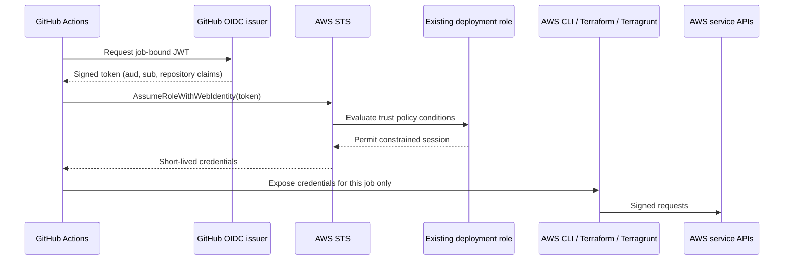

# GitHub OIDC to AWS



## Trust configuration

AWS must already contain the `https://token.actions.githubusercontent.com` OIDC provider with audience `sts.amazonaws.com`, plus one deployment role in each target account. The repository intentionally does not create those trust anchors.

Example environment-bound trust statement (replace placeholders):

```json
{
  "Effect": "Allow",
  "Principal": {"Federated": "arn:aws:iam::<ACCOUNT_ID>:oidc-provider/token.actions.githubusercontent.com"},
  "Action": "sts:AssumeRoleWithWebIdentity",
  "Condition": {
    "StringEquals": {
      "token.actions.githubusercontent.com:aud": "sts.amazonaws.com",
      "token.actions.githubusercontent.com:sub": "repo:<OWNER>/<REPOSITORY>:environment:prod"
    }
  }
}
```

PR planning needs a subject such as `repo:<OWNER>/<REPOSITORY>:pull_request`; main manual planning may need `repo:<OWNER>/<REPOSITORY>:ref:refs/heads/main`; environment-approved jobs use `repo:<OWNER>/<REPOSITORY>:environment:<ENVIRONMENT>`. Use separate trust statements or roles so broad branch trust does not erase the production environment boundary.

## Permission policy and diagnosis

The role needs S3 state/lock access, optional KMS access, SSM read, and only the EC2/VPC, ELBv2, ECS, IAM role/policy, CloudWatch Logs/alarms, and Application Auto Scaling actions represented by this module. Image jobs additionally need `ssm:PutParameter` on one named parameter. Restrict IAM role resources to the project prefix and require `iam:PassedToService=ecs-tasks.amazonaws.com` for `iam:PassRole`. Use IAM Access Analyzer and CloudTrail to refine the initial policy.

`Not authorized to perform sts:AssumeRoleWithWebIdentity` normally means provider ARN, audience, subject, repository case, branch, or environment differs from trust. Decode claims only with safe GitHub tooling; never print the full JWT. Each workflow immediately calls STS and compares the account ID, limiting wrong-role blast radius.

References: [AWS OIDC for GitHub](https://docs.aws.amazon.com/IAM/latest/UserGuide/id_roles_providers_create_oidc.html), [GitHub AWS OIDC](https://docs.github.com/actions/security-for-github-actions/security-hardening-your-deployments/configuring-openid-connect-in-amazon-web-services), [STS web identity](https://docs.aws.amazon.com/STS/latest/APIReference/API_AssumeRoleWithWebIdentity.html).

