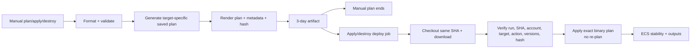

# Terraform pipeline and exact-plan guarantee

## Plan semantics

Terraform detailed exit code 0 means successful/no changes, 2 means successful/changes, and anything else is failure. The scripts temporarily disable shell fail-fast only to capture that value, explicitly accept 0 or 2, and then restore strict mode. A plan needs current SSM image JSON and remote-state access.

Manual plan/apply/destroy generates `plan.tfplan` plus full text and metadata. Artifact names include target, action, commit, and run ID; retention is three days. SHA-256 detects alteration. Metadata binds commit, target, expected account, region, action, workflow run, and tool versions. Plan and apply both run Ubuntu 24.04 with identical pinned versions.

For apply/destroy, a separate job checks out the same commit, downloads only the named artifact from the same run, verifies every field and hash, obtains fresh OIDC credentials, reinitialises the same backend, and invokes `terragrunt apply ... plan.tfplan`. It never creates another plan. Every operation requires main; destroy also requires exact text `DESTROY <target>`. GitHub Environments and approval gates are not used.

## Review, security, and failures

Treat binary plans as sensitive: they can embed values and convey deployment authority within the deploy job. Never attach artifacts from another workflow run or extend retention casually. Review resource replacement, public access, IAM, NAT/ALB cost, task digests, and destroys before dispatching apply or destroy.

Metadata mismatch, hash mismatch, different commit, expired artifact, state drift after plan, or provider inconsistency intentionally stops deployment. State drift can make exact-plan apply fail; generate and review a new plan rather than bypassing verification.

References: [saved plans](https://developer.hashicorp.com/terraform/cli/commands/plan), [apply](https://developer.hashicorp.com/terraform/cli/commands/apply), [artifacts](https://docs.github.com/actions/using-workflows/storing-workflow-data-as-artifacts).
