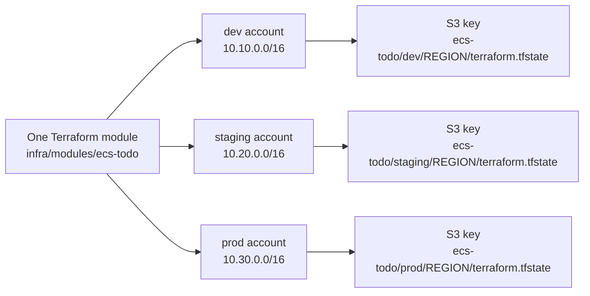

# Terragrunt multi-account model

## How it works

Terragrunt removes backend and account-input repetition without copying Terraform resources. `root.hcl` configures the shared S3 bucket, native lockfile, encryption, region, common tags, and state-key derivation. Each child selects the same module and supplies environment, account ID from a GitHub variable, SSM name, CIDRs, NAT count, and retention.

The three logical environments are separate AWS accounts, not Terraform workspaces. Isolation therefore exists in IAM credentials, provider account allowlisting, VPC addresses, and S3 object keys. CI pins Terragrunt 1.0.4 and verifies the downloaded binary checksum.

## Security, failures, and verification

`get_env` intentionally fails when required account IDs or the state bucket are missing. This prevents placeholder deployments. Run `terragrunt hcl validate --working-dir infra/live` for syntax. An account-bound `plan` additionally proves backend access, KMS access, provider credentials, SSM content, and module evaluation.

Incorrect relative sources cause cache errors; missing variables cause `get_env` errors; duplicate keys risk state collision. Inspect `terragrunt render --working-dir infra/live/dev` read-only and confirm keys in workflow logs without printing sensitive state.

References: [Terragrunt includes](https://terragrunt.gruntwork.io/docs/features/includes/), [remote state](https://terragrunt.gruntwork.io/docs/features/state-backend/), [Terraform workspaces](https://developer.hashicorp.com/terraform/language/state/workspaces).

